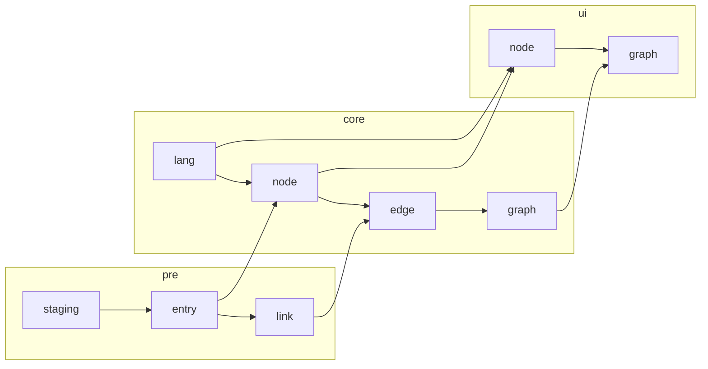

# Etyviz

**Etyviz** is an **ety**mology **vis**ualiser 
rendering etymological relationships in a static graph format.
Its main purpose is to present etymological information in a
standardized, print-friendly format to be used by
language enthusiasts and scholars alike.

## How it works

**Etyviz** takes the output of 
[Wiktextract](https://github.com/tatuylonen/wiktextract)
(more precisely the parsed dumps at 
[kaikki.org](https://kaikki.org/dictionary/rawdata.html)),
then extracts the relevant sections to build a 
[PostgreSQL](https://www.postgresql.org/) database of linked entities.

It queries the generated database based on the input given
in a very simple [UI interface](http://etyviz.mihai.lu/) and uses
[Graphviz](https://graphviz.org/) to render the output relationships graph.

## Showcase

pământ / visual

view more

## High level design

## Installation

See [Database installation](/docs/db.md).

## Features

## Similar tools

This project is the successor of
[Wiketym](https://github.com/mihnea-mihai/wiketym),
my first attempt at automatically generating etymology visualizations.
