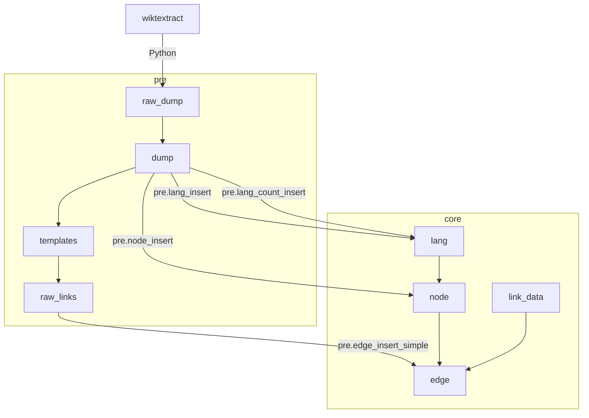

```mermaid
graph

    subgraph pre
        pre.raw_dump[raw_dump]
        pre.dump[dump]
        pre.templates[templates]
        pre.raw_links[raw_links]
    end

    subgraph core
        core.node[node]
        core.edge[edge]
        core.lang[lang]
        core.link_data[link_data]
    end


    wiktextract --Python--> pre.raw_dump --> pre.dump
    pre.dump --pre.node_insert--> core.node
    pre.dump --pre.lang_insert--> core.lang
    pre.dump --pre.lang_count_insert--> core.lang
    pre.dump --> pre.templates --> pre.raw_links
    pre.raw_links --pre.edge_insert_simple--> core.edge

    core.lang --> core.node --> core.edge
    core.link_data --> core.edge

```

347646	Bogdan	en