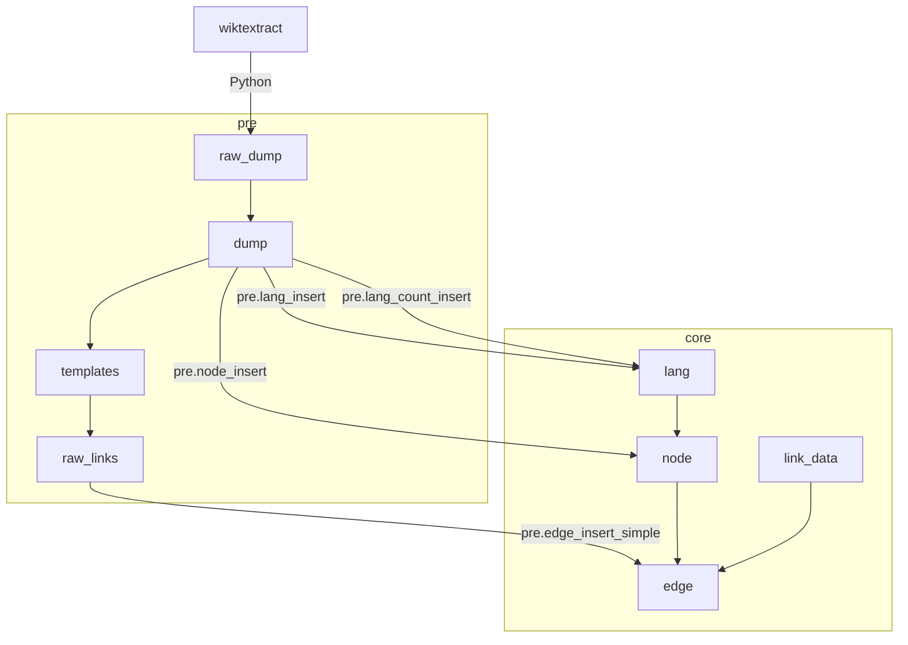
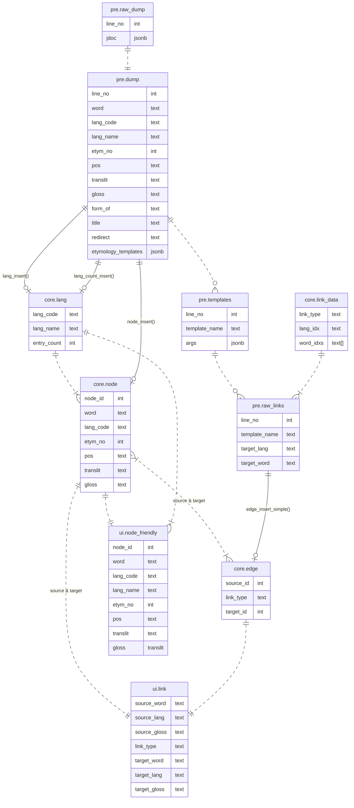

```mermaid
graph

    subgraph pre
        pre.raw_dump[raw_dump]
        pre.dump[dump]
        pre.templates[templates]
        pre.raw_links[raw_links]
    end

    subgraph core
        core.node[node]
        core.edge[edge]
        core.lang[lang]
        core.link_data[link_data]
    end


    wiktextract --Python--> pre.raw_dump --> pre.dump
    pre.dump --pre.node_insert--> core.node
    pre.dump --pre.lang_insert--> core.lang
    pre.dump --pre.lang_count_insert--> core.lang
    pre.dump --> pre.templates --> pre.raw_links
    pre.raw_links --pre.edge_insert_simple--> core.edge

    core.lang --> core.node --> core.edge
    core.link_data --> core.edge

```

347646	Bogdan	en

```mermaid
erDiagram
    RAW_DUMP["pre.raw_dump"] {
        line_no int
        jdoc jsonb
    }

    DUMP["pre.dump"] {
        line_no int
        word text
        lang_code text
        lang_name text
        etym_no int
        pos text
        translit text
        gloss text
        form_of text
        title text
        redirect text
        etymology_templates jsonb
    }

    TEMPLATES["pre.templates"] {
        line_no int
        template_name text
        args jsonb
    }

    RAW_LINKS["pre.raw_links"] {
        line_no int
        template_name text
        target_lang text
        target_word text
    }

    RAW_DUMP ||..|| DUMP : ""
    DUMP ||..o{ TEMPLATES : ""
    TEMPLATES ||..o{ RAW_LINKS : ""

    LANG["core.lang"] {
        lang_code text
        lang_name text
        entry_count int
    }

    NODE["core.node"] {
        node_id int
        word text
        lang_code text
        etym_no int
        pos text
        translit text
        gloss text
    }

    LINK_DATA["core.link_data"] {
        link_type text
        lang_idx text
        word_idxs text[]
    }

    EDGE["core.edge"] {
        source_id int
        link_type text
        target_id int
    }

    LANG ||..|{ NODE : ""
    NODE }|..|{ EDGE : "source & target"

    DUMP ||--o| LANG : "lang_insert()"
    DUMP ||--o| LANG : "lang_count_insert()"
    DUMP ||--o| NODE : "node_insert()"

    RAW_LINKS ||--o| EDGE : "edge_insert_simple()"
    LINK_DATA ||..|{ RAW_LINKS : ""

    NODE_FRIENDLY["ui.node_friendly"] {
        node_id int
        word text
        lang_code text
        lang_name text
        etym_no int
        pos text
        translit text
        gloss translit
    }

    NODE ||..|| NODE_FRIENDLY : ""
    LANG ||..|{ NODE_FRIENDLY : ""

    LINK["ui.link"] {
        source_word text
        source_lang text
        source_gloss text
        link_type text
        target_word text
        target_lang text
        target_gloss text
    }

    NODE ||..|| LINK : "source & target"
    EDGE ||..|| LINK : ""

```