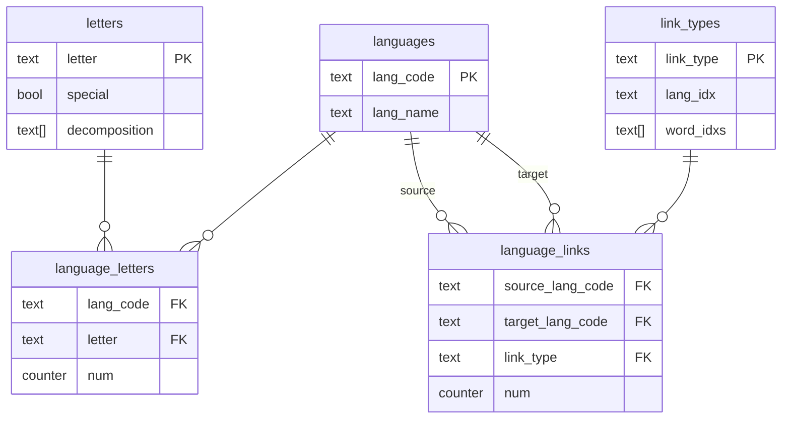

```mermaid
erDiagram
    languages {
        text lang_code PK
        text lang_name
    }

    letters {
        text letter PK
        bool special
        text[] decomposition
    }

    language_letters {
        text lang_code FK
        text letter FK
        counter num
    }

    letters ||--o{ language_letters : ""
    languages ||--o{ language_letters : ""

    language_links {
        text source_lang_code FK
        text target_lang_code FK
        text link_type FK
        counter num
    }

    link_types {
        text link_type PK
        text lang_idx
        text[] word_idxs
    }


    languages ||--o{ language_links : "source"
    languages ||--o{ language_links : "target"
    link_types ||--o{ language_links : ""


```