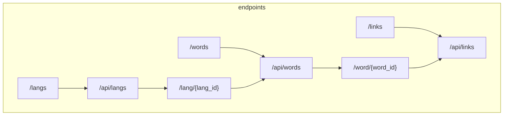

This is **my** test.

```mermaid
graph
subgraph endpoints
    url.langs["/langs"]
    url.lang["/lang/{lang_id}"]
    url.words["/words"]
    url.word["/word/{word_id}"]
    url.links["/links"]
    url.api.langs["/api/langs"]
    url.api.words["/api/words"]
    url.api.links["/api/links"]

    url.langs --> url.api.langs --> url.lang
    url.links --> url.api.links
    url.words --> url.api.words --> url.word
    url.lang --> url.api.words
    url.word --> url.api.links

    

end
```